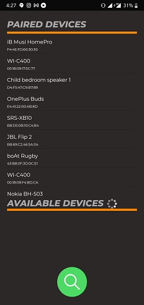

# Arduino Bluetooth Controller

---
## Table of Content

* [Description](#description)
* [Requirements](#requirements)
* [Working](#working)
* [App Demo](#app-demo)
* [Author Info](#author-info)

---

## Description

Android App for Controlling Arduino Bluetooth Modules like Hc05 , Hc06, etc..

Send string data using Bluetooth module to Arduino via Hc05 and Hc06 Bluetooth modules.
Convert Your Phone into a remote controller and control your project via Arduino Bluetooth module.

---
## Requirements

* Andriod 4.4 or higher version
* Bluetooth Support

---

## Working

---

## Process Flow

---

## Data Flow Diagram

---

## App Demo

[Video Link](https://youtu.be/48jCTzEHn7Y)

## Author Info

* [Dhruv Mehta](https://github.com/dhruv-mehta99)
* [Gracika Rajput](https://github.com/gracika)
* [Ishan Patel](https://github.com/ishan1410)
* [Yash Shah](https://github.com/yash156)
