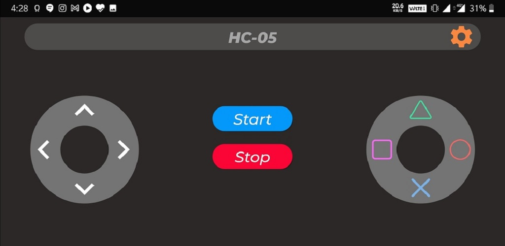
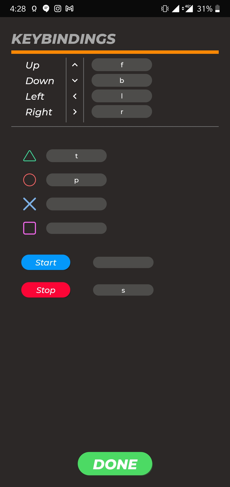

# Arduino Bluetooth Controller

---
## Table of Content

* [Description](#description)
* [Requirements](#requirements)
* [Working](#working)
* [Play Store](#play-store)
---

## Description

Android App for Controlling Arduino Bluetooth Modules like Hc05 , Hc06, etc..

Send string data using Bluetooth module to Arduino via Hc05 and Hc06 Bluetooth modules.
Convert Your Phone into a remote controller and control your project via Arduino Bluetooth module.

---
## Requirements

* Andriod 4.4 or higher version
* Bluetooth Support

---

## Working

### Device Searching Page

* Open the app and this page appears.
* Select your Bluetooth device either from paired devices list or scan for a new device.

### Bluetooth Controller

* This is the remote control page.
* Tap on the Settings button on the top right corner to configure your App with your Bluetooth Module.

### Key Bindings

* This is the controller configuration page.
* Enter the value that is to be sent to your Bluetooth module on the tap of each available key.
* Click Done when completed with Binding key to its corresponding values.

---

## Play Store

[App Link](https://play.google.com/store/apps/details?id=com.innoventx.bluetoothcontroller)
